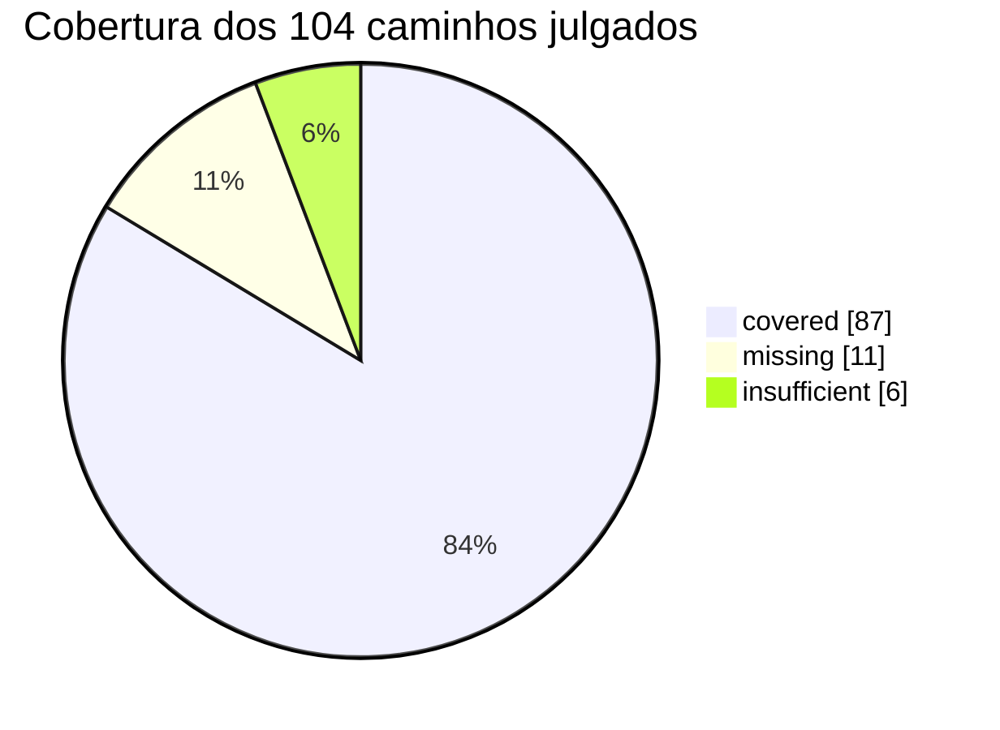

# Auditoria de cobertura de logs — `storefront-permissions`


| | |
|---|---|
| **Data** | 2026-08-21 |
| **Commit auditado** | `c3c6dbe` (branch `docs/log-coverage-audit`) |
| **Escopo** | `node/**/*.ts` — 44 arquivos (exclui `*.d.ts` e `node/typings/`) |
| **Unidade contada** | caminho de erro ou decisão que aborta/desvia a operação (bloco `catch`, `.catch()` que engole o erro, e branch de validação que interrompe um write) |
| **Fora do denominador** | helpers puros sem efeito colateral, shims de rethrow (`statusToError`) e os caminhos latentes da seção [Latentes](#latentes-sem-call-site-atual) |

> Auditoria independente. As duas auditorias anteriores foram registradas no commit `508bff6`
> (2026-03-04); desde então `node/resolvers/Routes/index.ts` (+467 linhas) e
> `node/resolvers/Queries/Users.ts` mudaram, então os números de linha antigos não valem mais aqui.

---

## Score

**87 / 104 ≈ 84%**

O denominador são os 104 caminhos de erro/decisão alcançáveis e com efeito colateral encontrados em
`node/`. `covered` = existe log com contexto real (objeto de erro e/ou identificador) próximo ao
caminho, em qualquer nível razoável.



### Cobertura por módulo

| Módulo | Cobertura | | covered | missing | insufficient |
|---|---:|---|---:|---:|---:|
| `resolvers/Routes/` | 92% | `██████████████████░░` | 23 | 1 | 1 |
| `directives/` | 88% | `█████████████████░░░` | 14 | 2 | 0 |
| `resolvers/Queries/` | 87% | `█████████████████░░░` | 26 | 4 | 0 |
| `resolvers/Mutations/` | 76% | `███████████████░░░░░` | 22 | 3 | 4 |
| `metrics/` | 67% | `█████████████░░░░░░░` | 2 | 0 | 1 |
| `clients/` | 0% | `░░░░░░░░░░░░░░░░░░░░` | 0 | 1 | 0 |

O ponto fraco não é volume de log — o serviço loga bastante e com objeto de erro estruturado. O
padrão que aparece nos achados é outro: **`.catch()` que converte falha de infraestrutura em valor de
negócio** (`null`, `false`, `{}`, `[]`). Nesses pontos a falha não só passa sem log, ela passa
disfarçada de resposta válida.

---

## Achados

Ordenados por quanto a lacuna pode esconder uma falha real de produção.

| # | Local | O que o caminho faz | Status | Por quê |
|---|---|---|---|---|
| 1 | `node/resolvers/Queries/Settings.ts:21` | lê `b2b_settings` do VBase antes de reescrevê-lo (`saveJSON` na linha 76) | `missing` | falha de leitura vira `{}`, o app conclui que não há settings, roda o re-sync de schema e **sobrescreve** `b2b_settings` com um objeto novo |
| 2 | `node/resolvers/Mutations/Settings.ts:12` | lê `b2b_settings` antes de gravar `sessionWatcher` (`saveJSON` na linha 21) | `missing` | mesmo read-modify-write: falha de leitura descarta `adminSetup.schemaHash` e qualquer outra chave no save seguinte |
| 3 | `node/resolvers/Mutations/Users.ts:135` | `getUser` — busca o usuário B2B no Masterdata | `missing` | `.catch(() => null)`; `null` é indistinguível de "usuário não existe". Consumido por `setProfile` (`Routes/index.ts:291`) e pelas mutations de vínculo (`:457`, `:510`, `:599`) |
| 4 | `node/clients/checkout.ts:276` | `changeToAnonymousUser` — desvincula o carrinho do usuário anterior | `missing` | a condição está invertida: só re-lança quando **não** há `response` ou o código é 3xx, engolindo 4xx/5xx. Falha de desvínculo de carrinho passa em silêncio |
| 5 | `node/directives/withUserPermissions.ts:24` | busca a sessão antes de resolver as permissões do usuário | `missing` | `.catch(() => null)` sem log e sem métrica; `sessionData` nulo segue para `checkUserPermission({ skipError: true })` |
| 6 | `node/resolvers/Queries/Settings.ts:79` | `syncRoles` durante o bootstrap de settings | `missing` | `.catch(() => [])` faz `adminSetup.roles` virar `false` e ser persistido como se a sincronização tivesse rodado |
| 7 | `node/resolvers/Mutations/Roles.ts:103` | `syncRoles` monta a lista de roles a persistir | `missing` | `if (currRole.name)` descarta em silêncio toda role cujo slug não está em `roleNames` do locale — role de permissão simplesmente não é criada |
| 8 | `node/resolvers/Queries/Users.ts:789` | busca o perfil do usuário impersonado | `missing` | `.catch(() => null)` é traduzido para `{ error: 'User not found' }` na linha 792 — indisponibilidade do Profile System é reportada ao cliente como usuário inexistente |
| 9 | `node/resolvers/Queries/Settings.ts:94` | lê `b2b_settings` em `getSessionWatcher` | `missing` | falha de leitura vira `{}` e o `?? true` da linha 99 devolve `sessionWatcher` ativo por padrão |
| 10 | `node/resolvers/Routes/index.ts:103` | rota `appSettings` | `missing` | `getAppSettings` sem `try/catch` e sem log; a rota é pública e a falha sai sem contexto do app |
| 11 | `node/directives/auditAccess.ts:17` | dispara a métrica de auditoria de acesso | `missing` | `this.sendAuthMetric(...)` é chamado sem `await` e sem `.catch()`; se os acessos a `request.headers` (`:29-40`) lançarem, a rejeição fica órfã e silenciosa |
| 12 | `node/resolvers/Routes/index.ts:86` | `timedSetProfile` — instrumentação de falha de cada passo do `setProfile` | `insufficient` | loga em `logger.debug` (filtrado em produção) e **sem o objeto `error`**. É o único registro de *qual* passo falhou, e o `setProfile` não tem `try/catch` externo |
| 13 | `node/resolvers/Mutations/Users.ts:149`<br>`node/resolvers/Mutations/Users.ts:177`<br>`node/resolvers/Mutations/Users.ts:222` | `updateUserFields`, `addSelectedPriceTableToB2bUser`, `createPermission` — writes no Masterdata | `insufficient` | mesmo padrão nos três: `if (error.response.status < 400)` trata erro como sucesso sem log, e o acesso direto a `.response` lança `TypeError` em erro de rede, mascarando o erro original |
| 14 | `node/resolvers/Mutations/Users.ts:80` | `addUserToMasterdata` — recupera de `duplicated entry` buscando o documento existente | `insufficient` | colisão em criação de usuário é resolvida em silêncio; se a busca voltar vazia, `res[0].id` lança `TypeError` no lugar do erro real |
| 15 | `node/utils/metrics/changeTeam.ts:54` | falha ao enviar a métrica de troca de organização | `insufficient` | usa `console.warn` em vez do `logger` estruturado e descarta o contexto que está à mão em `metricParams` (`userId`, `userEmail`, `orgId`, `costCenterId`) |

---

## Correções

Snippets no estilo já usado no serviço: `logger.error({ error, message: '<escopo>.<causa>' })`.

### 1 e 2 — read-modify-write de `b2b_settings`

Os dois pontos leem, mutam e regravam a mesma chave do VBase. Falha de leitura precisa ser visível
**e** não deve seguir para o `saveJSON`.

`node/resolvers/Queries/Settings.ts:21` — `warn` + flag para não regravar:

```ts
let settingsReadFailed = false

const settings = (await vbase.getJSON('b2b_settings', app).catch((error) => {
  settingsReadFailed = true
  logger.warn({
    error,
    message: 'getAppSettings.getSettingsError',
    app,
  })

  return {}
})) as { adminSetup: { schemaHash?: string | null; roles?: string[] | boolean | null } }
```

E na linha 76, não sobrescrever o que não foi lido:

```ts
if (settingsReadFailed) {
  logger.warn({ message: 'getAppSettings.skipSaveAfterReadFailure', app })
} else {
  await vbase.saveJSON('b2b_settings', app, settings)
}
```

`node/resolvers/Mutations/Settings.ts:12` — mesma leitura, e aqui o save é o objetivo da mutation,
então o certo é abortar:

```ts
const settings: any = await vbase.getJSON('b2b_settings', app).catch((error) => {
  logger.error({
    error,
    message: 'sessionWatcher.getSettingsError',
    app,
  })

  throw error
})
```

### 3 — `getUser` engolindo falha do Masterdata

`node/resolvers/Mutations/Users.ts:103` não recebe `ctx`, só `masterdata`. Todos os quatro call sites
têm `ctx`, então a correção é passar o `logger` adiante:

```ts
export const getUser = async ({
  masterdata,
  logger,
  params: { email, id, userId },
}: any) => {
  const where = id || userId ? `id=${id || userId}` : `email=${email}`

  return masterdata
    .searchDocuments({ /* ...inalterado... */ })
    .then((res: any) => (res.length > 0 ? res[0] : null))
    .catch((error: any) => {
      logger?.error({
        error,
        message: 'getUser.searchDocumentsError',
        where,
      })

      return null
    })
}
```

Chamadas: `Routes/index.ts:291` e `Mutations/Users.ts:457`, `:510`, `:599` passam
`logger: ctx.vtex.logger`.

### 4 — `changeToAnonymousUser` com condição invertida

`node/clients/checkout.ts:276`. A classe é um `JanusClient` e não tem `logger`; guarde `ctx.logger`
no construtor (`IOContext` já o expõe) e corrija o predicado para engolir **apenas** o 3xx esperado:

```ts
// no construtor: this.logger = ctx.logger
public changeToAnonymousUser = (orderFormId: string) => {
  return this.get(this.routes.changeToAnonymousUser(orderFormId), {
    metric: 'checkout-change-to-anonymous',
  }).catch((err) => {
    // Este endpoint responde com redirect, então 3xx é o caminho de sucesso.
    if (/^3..$/.test(String((err as AxiosError).response?.status ?? ''))) {
      return
    }

    this.logger.error({
      error: err,
      message: 'checkout.changeToAnonymousUserError',
      orderFormId,
    })

    throw err
  })
}
```

### 5 — sessão nula no directive de permissões

`node/directives/withUserPermissions.ts:24`:

```ts
context.vtex.sessionData = await session
  .getSession(context.vtex.sessionToken as string, ['*'])
  .then((currentSession: any) => currentSession.sessionData)
  .catch((error: any) => {
    context.vtex.logger.warn({
      error,
      message: 'withUserPermissions.getSessionError',
      operation: field.astNode?.name?.value ?? context.request.url,
    })

    return null
  })
```

### 6 — `syncRoles` no bootstrap de settings

`node/resolvers/Queries/Settings.ts:79`:

```ts
const roles: any = await syncRoles(ctx).catch((error) => {
  logger.error({
    error,
    message: 'getAppSettings.syncRolesError',
  })

  return []
})
```

### 7 — role descartada em silêncio

`node/resolvers/Mutations/Roles.ts:103`:

```ts
if (currRole.name) {
  newRoles.push(currRole)
} else if (roleIndex === -1) {
  ctx.vtex.logger.warn({
    message: 'syncRoles.roleNameNotFound',
    slug,
    locale: ctx.vtex.tenant?.locale,
  })
}
```

### 8 — perfil do usuário impersonado

`node/resolvers/Queries/Users.ts:789`:

```ts
const userData: any = await profileSystem
  .getProfileInfo(profile.id.value)
  .catch((error: any) => {
    logger.error({
      error,
      message: 'checkImpersonation.getProfileInfoError',
      profileId: profile.id.value,
    })

    return null
  })
```

### 9 — `getSessionWatcher`

`node/resolvers/Queries/Settings.ts:94`:

```ts
const settings: any = await vbase.getJSON('b2b_settings', app).catch((error) => {
  logger.warn({
    error,
    message: 'getSessionWatcher.getSettingsError',
    app,
  })

  return {}
})
```

Vale notar que o `try/catch` da linha 98 envolve só o `settings?.sessionWatcher?.active ?? true` —
uma leitura de propriedade opcional que praticamente não lança. O `catch` da linha 100 está no lugar
errado; a falha real está na linha 94.

### 10 — rota `appSettings`

`node/resolvers/Routes/index.ts:103`:

```ts
appSettings: async (ctx: Context) => {
  const appId = process.env.VTEX_APP_ID ? process.env.VTEX_APP_ID : ''

  try {
    const { disableSellersNameFacets, disablePrivateSellersFacets } =
      await ctx.clients.apps.getAppSettings(appId)

    return { disableSellersNameFacets, disablePrivateSellersFacets }
  } catch (error) {
    ctx.vtex.logger.error({
      error,
      message: 'appSettings.getAppSettingsError',
      appId,
    })

    throw error
  }
},
```

### 11 — métrica de auditoria órfã

`node/directives/auditAccess.ts:17`:

```ts
this.sendAuthMetric(field, context).catch((error) => {
  context.vtex.logger.warn({
    error,
    message: 'auditAccess.sendAuthMetricError',
    operation: field.astNode?.name?.value,
  })
})
```

### 12 — instrumentação do `setProfile` cega em produção

`node/resolvers/Routes/index.ts:86`. O `catch` já tem o `error` em mãos; hoje ele não vai para o log
e o nível `debug` não é indexado em produção. Como o `setProfile` não tem `try/catch` externo, este é
o único ponto que sabe **qual** passo quebrou:

```ts
} catch (error) {
  const now = Date.now()
  const stepTiming: SetProfileStepTiming = {
    step,
    durationMs: now - start,
    failed: true,
    totalMs: now - timing.t0,
  }

  steps.push(stepTiming)

  logger.error({
    error,
    message: 'setProfile.stepFailed',
    step,
    durationMs: stepTiming.durationMs,
    totalMs: stepTiming.totalMs,
    steps: [...steps],
  })
  throw error
}
```

O `logger.debug` do caminho de sucesso (`:39` e `:66`) pode ficar como está — ali `debug` é a escolha
certa para timing de alto volume.

### 13 e 14 — writes no Masterdata que tratam erro como sucesso

Padrão repetido em `node/resolvers/Mutations/Users.ts:149`, `:177` e `:222`. Vale extrair um helper
único em vez de corrigir os três no lugar:

```ts
const resolveWriteConflict = (
  { error, id, operation, logger }: any
) => {
  const status = error?.response?.status

  if (status && status < 400) {
    logger.warn({
      error,
      message: `${operation}.nonErrorStatus`,
      id,
      status,
    })

    return { DocumentId: id }
  }

  logger.error({ error, message: `${operation}.writeError`, id, status })

  throw error
}
```

Ler `error?.response?.status` com optional chaining também remove o `TypeError` que hoje mascara
erros de rede. Em `:80` (`addUserToMasterdata`), o mesmo cuidado no branch de `duplicated entry`:

```ts
.catch((error: any) => {
  if (error.response?.data?.Message === 'duplicated entry') {
    logger.warn({ error, message: 'addUserToMasterdata.duplicatedEntry', email })

    return masterdata
      .searchDocuments({ /* ...inalterado... */ })
      .then((res: [{ id: string }]) => {
        if (!res?.length) {
          logger.error({
            message: 'addUserToMasterdata.duplicatedEntryNotFound',
            email,
          })
          throw error
        }

        return { DocumentId: res[0].id }
      })
  }

  throw error
})
```

### 15 — `console.warn` na métrica de troca de organização

`node/utils/metrics/changeTeam.ts:54`. `console.*` não entra no índice de logs da VTEX IO da mesma
forma que `ctx.vtex.logger`, e o contexto está todo em `metricParams`:

```ts
export const sendChangeTeamMetric = async (
  metricParams: ChangeTeamParams,
  logger?: Context['vtex']['logger']
) => {
  try {
    const metric = buildMetric(metricParams)

    await sendMetric(metric)
  } catch (error) {
    logger?.warn({
      error,
      message: 'sendChangeTeamMetric.sendMetricError',
      userId: metricParams.userId,
      orgId: metricParams.orgId,
      costCenterId: metricParams.costCenterId,
    })
  }
}
```

O call site em `node/resolvers/Mutations/Users.ts:696` passa `ctx.vtex.logger`.

---

## Latentes (sem call site atual)

`node/utils/LicenseManager.ts` não tem **nenhuma** chamada de log e concentra seis `.catch()` que
devolvem `null` / `false` / `{}` sem registrar nada: `:29` (`getUserIdByEmail`), `:50` e `:58`
(`saveUser`), `:74` (`deleteUser`), `:119` e `:137` (`hasBuyerOrganizationViewRole` /
`hasBuyerOrganizationEditRole`).

Os dois últimos são os mais desconfortáveis conceitualmente — uma verificação de permissão que
devolve `false` tanto para "não tem a role" quanto para "o License Manager está fora". **Nenhum dos
seis tem call site no repositório hoje**, então ficam fora do denominador: são risco latente, não
ponto cego em produção. Se algum voltar a ser usado, precisa de log antes.

Os dois métodos do arquivo que estão de fato no caminho de autenticação — `getUserAdminPermissions`
(`:81`) e `checkUserSpecificRole` (`:89`) — não engolem erro: propagam para `directives/helper.ts`,
que loga nos `catch` das linhas 70, 157 e 210. Esses contam como `covered`.

---

## Padrão transversal: `throw new Error(error)`

Seis sites re-lançam o erro assim: `Queries/Users.ts:128`, `:844`, `:914`, `:969`,
`Queries/Settings.ts:72` e `Queries/Roles.ts:59`.

`new Error(error)` serializa o objeto para string — o erro que chega ao chamador vira
`Error: [object Object]`, sem `response`, sem status e sem a stack original. Nos cinco primeiros já
existe um `logger.error` local antes do `throw`, então **não conta como achado** e não muda o score.
Ainda vale trocar por `throw error` (ou `new Error(message, { cause: error })`), porque hoje qualquer
log a montante desses pontos é inútil. `Queries/Roles.ts:59` é o único sem log local, coberto apenas
pelos chamadores (`:77` e `:110`).

---

## Verificado e considerado adequado

Registrado para que decisões deliberadas não sejam reabertas na próxima auditoria.

- **`node/directives/withSession.ts:26`** — `.catch(() => null)` sem log é **intencional**. O
  comentário das linhas 28-31 explica a troca de log por métrica (`SessionMetric`) justamente por
  volume alto de logs nesse caminho. Continua adequado.
- **`node/resolvers/Routes/index.ts:890`** — `Promise.all(promises)` sem `await` e sem `.catch()` é
  intencional ("avoid session timeout"). Cada promise da lista já tem `.catch()` com `logger.error`
  antes de entrar em `timedSetProfile`, então nenhuma rejeição fica órfã.
- **`node/directives/helper.ts`** — as quatro funções de validação de token logam negação de acesso
  com contexto (`:42`, `:72`, `:129`, `:159`, `:212`). É o módulo mais bem coberto do serviço.
- **`node/resolvers/Routes/index.ts`** — os doze `catch` do `setProfile` (`:317`, `:343`, `:378`,
  `:433`, `:457`, `:497`, `:706`, `:741`, `:777`, `:805`, `:827`, `:879`) têm `logger.error`/`warn`
  adjacente com objeto de erro. O único problema do arquivo é o `timedSetProfile` (achado 12).
- **`node/resolvers/Queries/Roles.ts:43`** — o branch de 404 cai para o Masterdata; é o caminho
  normal de bootstrap quando o VBase ainda não tem `b2b_roles`, não um erro.
- **`node/services/appSettingsCache.ts`** — sem log e sem `catch` de propósito: a falha de
  `getAppSettings` propaga para quem chama, e os chamadores logam (`Queries/Users.ts:701`).
- **`node/clients/metrics.ts:15`** — `axios.post` sem tratamento; os três chamadores envolvem em
  `try/catch` (`metrics/auth.ts:43`, `metrics/session.ts:38`, `utils/metrics/changeTeam.ts:53`).
- **Shims `statusToError`** (`clients/checkout.ts`, `utils/LicenseManager.ts:142-156`) — convertem e
  propagam o erro, não engolem. Fora do denominador.

## Observação fora de escopo

`node/resolvers/Routes/index.ts:900` loga `JSON.stringify(body)` e `JSON.stringify(response)`
completos em `logger.info` a cada `setProfile`. Não é lacuna de cobertura, mas o payload carrega
e-mail, endereço e dados de perfil — vale revisar volume e PII junto com o time.
